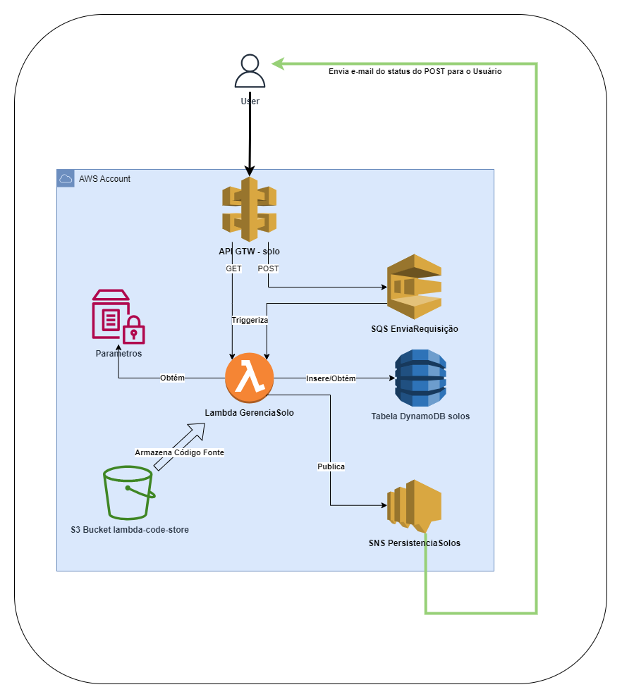
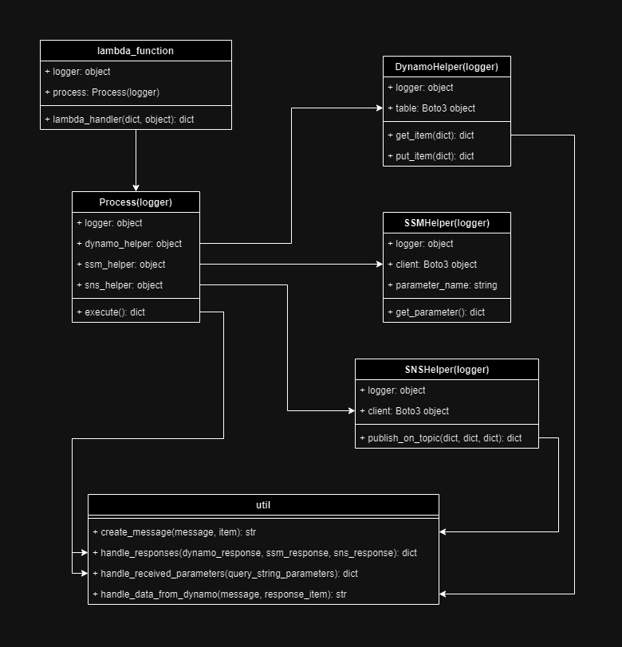

<h2 align="center">ArquiteturaMicroservicesEServerless31CLD</h2>
<h4 align="center">Repositório contendo todo o conteudo do 
trabalho de conclusão da máteria Arquitetura Microservices
e Serverless da turma 31CLD FIAP Campus Av Paulista.</h4>

<h5 align="center">Arquitetura de Micro Serviços e Serverless</h5>

<h5 align="center">Fluxograma da Aplicação GerenciaSolo</h5>

<h5 align="center">Diagrama de classes da Aplicação GerenciaSolo</h5>