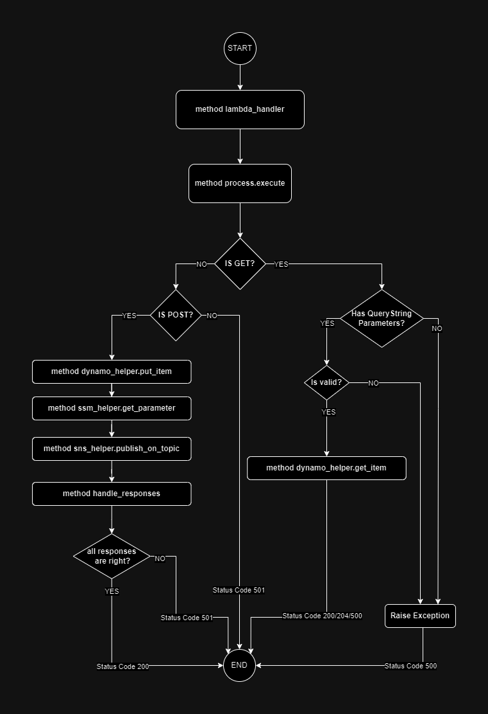

## Trabalho de Arquitetura de MicroServices and Serverless Turma 31CLD
<h4>Repositório contendo todo o conteudo do 
trabalho de conclusão da máteria Arquitetura Microservices
e Serverless</h4>

<h5 align="center">Arquitetura da solução</h5>

## Como rodar a aplicação
Dependências:
- [AWS CLI 2.0](https://docs.aws.amazon.com/cli/latest/userguide/getting-started-install.html)
- [Python +3.8](https://www.python.org/downloads/)
- [Gitbash](https://git-scm.com/downloads)
- [Pycharm community edition](https://www.jetbrains.com/pycharm/download/)(ou seu IDE preferido)

## Como rodar a aplicação
    1 - Baixar o repositório e entrar na pasta appgerenciasolo/
    2 - Instalar a Lib virtualenv em seu python, configurar e instalar as dependências:
        -> python -m pip install virtualenv
        -> pip virtualenv venv
        -> source venv/Scripts/activate
        -> pip install -r requirements.txt
    3 - Ter as Access/Secrets Keys do usuário IAM na conta AWS em questão onde a arquitetura foi criada.
    4 - Executar localmente pelo pytest conforme GIF abaixo

## Arquitetura da solução
Arquitetura do serviço de gerencia de solos, basicamente temos um API GTW que aceita apenas requisições GET/POST,
quando o fluxo é via POST, o conteudo da requisição é adicionado em uma fila SQS que trigeriza uma Lambda(No caso
o código da mesma encontra-se dentro da pasta appgerenciasolo) e a mesma tem integração com o SSM Parameter Store,
com o DynamoDB e o SNS informando o status da gravação na base de dados. Quando a requisição é um GET é direcionado
diretamente pra Lambda Function(mesma aplicação) e realiza a obtenção dos dados na tabela do DynamoDB.

## Fluxograma da Aplicação GerenciaSolo

<h5 align="center">Fluxograma da Aplicação GerenciaSolo</h5>

## Diagrama de classes da Aplicação GerenciaSolo

<h5 align="center">Diagrama de classes da Aplicação GerenciaSolo</h5>